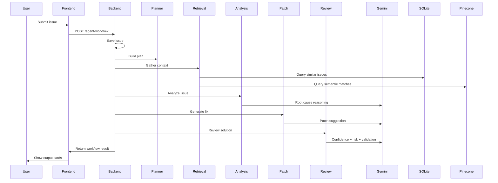
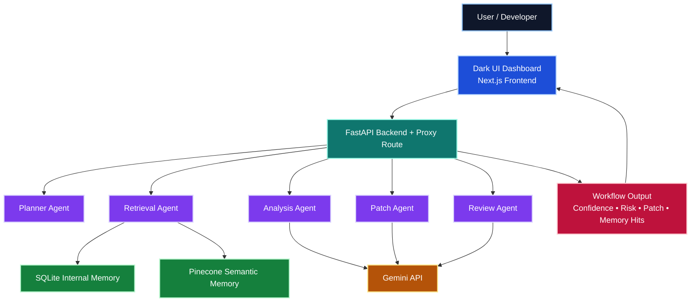

<<<<<<< HEAD
# stack used for this project:

# Frontend: Next.js + TypeScript + Tailwind or custom CSS
# Backend: Python + FastAPI
# Agents: LangGraph or LangChain with multiple autonomous agents
# LLM: OpenAI
# Vector DB: Pinecone
# Internal memory / metadata DB: PostgreSQL or SQLite for MVP
# Code parsing: Python AST, tree-sitter, or simple file scanners
# Task queue later: Celery / Redis or Temporal 
# Sandbox: mock execution now, E2B 
# Observability: basic logs now, OpenTelemetry  

# agents to create:
# for bug: debug logic and patch code
# for code_review: review maintainability and suggest improvements
# for test_failure: inspect failing test and likely cause
# for api_error: look for schema/route/validation mismatches
# for ci_cd_issue: inspect pipeline config and dependency failures
# for performance_issue: flag bottlenecks and heavy operations
# for deployment_issue: focus on env/config/server startup problems
=======
# Code Debugger AI

<p align="center">
  
  
  
  
  
  
</p>

<p align="center">
  <strong>Autonomous multi-agent software debugging platform for real-world engineering issues.</strong>
</p>

---

## Overview

Code Debugger AI is a full-stack autonomous multi-agent software engineering assistant built to analyze, diagnose, and propose fixes for real-world development problems.

Instead of focusing only on simple code bugs, this platform is designed for broader software engineering scenarios such as:

- code bugs
- code review issues
- test failures
- API errors
- CI/CD failures
- performance issues
- deployment incidents

The system combines:

- a dark, product-style frontend built with Next.js
- a FastAPI backend for orchestration
- Gemini-powered reasoning agents
- SQLite for internal issue history
- Pinecone for semantic memory retrieval

The result is a project that demonstrates full-stack development, multi-agent system design, retrieval-augmented workflows, AI-assisted debugging, and modern software architecture.

---

## What It Does

A developer submits an engineering issue through the UI, including:

- issue type
- project name
- error summary
- detailed problem description
- code snippet, logs, config, command, or workflow YAML

The platform then runs a multi-agent workflow:

1. **Planner Agent**
   Creates a structured investigation plan based on issue type.

2. **Retrieval Agent**
   Pulls relevant context from:
   - internal SQLite issue history
   - Pinecone semantic memory
   - issue-type-specific debugging heuristics

3. **Analysis Agent**
   Uses Gemini to identify the most likely root cause, affected system area, and next debugging checks.

4. **Patch Agent**
   Uses Gemini to propose a practical repair, config change, workflow fix, or patch preview.

5. **Review Agent**
   Uses Gemini to critique the proposed solution, estimate confidence, classify risk, and recommend validation steps.

The frontend then displays:

- workflow results
- memory hits
- semantic matches
- patch suggestions
- review confidence
- risk level
- autonomy signals

---

## Key Features

### Multi-Agent Workflow
- Planner Agent
- Retrieval Agent
- Analysis Agent
- Patch Agent
- Review Agent

### Real-World Issue Types
- `bug`
- `code_review`
- `test_failure`
- `api_error`
- `ci_cd_issue`
- `performance_issue`
- `deployment_issue`

### AI-Powered Reasoning
- Gemini-powered root cause analysis
- Gemini-powered patch suggestions
- Gemini-powered dynamic review and validation guidance

### Memory and Retrieval
- SQLite memory for past issue history
- Pinecone semantic similarity search
- retrieval-aware debugging context

### Product UI
- dark blue developer-focused interface
- dedicated pages for:
  - Dashboard
  - New Issue
  - Agent Workflow
  - Patch Review
  - Knowledge Memory

### Autonomy Signals
- workflow branching by issue type
- retry/fallback logic
- memory-aware retrieval
- handoff visibility across agents

### Multimodal Direction
Current MVP input supports:
- text issue descriptions
- logs
- stack traces
- code snippets
- config files
- commands
- workflow YAML

Planned multimodal expansion:
- screenshots of errors
- architecture diagrams
- terminal screenshots
- deployment dashboard images
- API screenshots
- uploaded files and visual debugging context

This means the architecture is already positioned to grow into a **multimodal developer support system**, not just a text-only bug analyzer.

---

## Architecture

## High-Level Architecture




## Tech Stack

### Frontend
- Next.js
- React
- TypeScript
- Custom CSS
- Local workflow history in browser storage

### Backend
- Python
- FastAPI
- Pydantic
- Uvicorn

### AI / Retrieval
- Gemini API
- Pinecone
- SQLite

### Design Concepts
- multi-agent orchestration
- retrieval-augmented reasoning
- semantic memory
- branching workflows
- fallback logic
- progressive autonomy

---

## Project Structure

```text
code-debugger/
  frontend/
    app/
      api/
      dashboard/
      new-issue/
      agent-workflow/
      patch-review/
      knowledge-memory/
      globals.css
      layout.tsx
      page.tsx
    components/
      Sidebar.tsx
      Topbar.tsx
    lib/
      workflow-store.ts

  backend/
    app/
      agents/
        planner_agent.py
        retrieval_agent.py
        analysis_agent.py
        patch_agent.py
        review_agent.py
      api/
        routes.py
      core/
        config.py
      db/
        database.py
      models/
        issue.py
      services/
        agent_workflow.py
        issue_service.py
        llm_service.py
        pinecone_service.py
      main.py
    requirements.txt
    .env

  docs/
```

---

## Pages in the UI

### Dashboard
Shows:
- recent workflow runs
- average confidence
- memory hit counts
- latest run overview

### New Issue
Allows users to submit:
- issue type
- project name
- summary
- details
- code / config / commands

### Agent Workflow
Displays:
- planner output
- retrieval reasoning
- analysis response
- patch generation
- review output

### Patch Review
Shows:
- patch preview
- confidence
- risk
- validation steps

### Knowledge Memory
Shows:
- SQLite memory hits
- Pinecone semantic matches
- recent stored runs

---

## Supported Issue Types

### 1. Bug
Example:
- incorrect arithmetic logic
- broken conditions
- edge-case failure

### 2. Code Review
Example:
- maintainability concerns
- duplication
- unclear structure
- weak naming

### 3. Test Failure
Example:
- failing unit test
- assertion mismatch
- flaky test setup

### 4. API Error
Example:
- 422 validation failures
- schema mismatch
- request parsing errors
- alias/field issues

### 5. CI/CD Issue
Example:
- GitHub Actions failures
- dependency install issues
- environment variable problems
- pipeline misconfiguration

### 6. Performance Issue
Example:
- repeated work
- inefficient loops
- slow queries
- missing caching

### 7. Deployment Issue
Example:
- broken health checks
- wrong port binding
- startup crashes
- container misconfiguration

---

## Memory Model

The platform uses two memory layers:

### SQLite
Used for:
- internal issue history
- recent stored runs
- structured lookup by issue type or project

### Pinecone
Used for:
- semantic retrieval of similar incidents
- context-aware debugging
- matching related engineering problems across past runs

This separation allows the system to combine:
- exact structured memory
- semantic engineering memory

---

## Current Autonomy Level

This project uses **semi-autonomous specialized agents**.

Current autonomy features:
- issue-type-aware branching
- structured handoffs between agents
- LLM-backed reasoning
- retry/fallback behavior
- memory-aware retrieval

Current limitations:
- agents do not yet dynamically choose external tools
- agents do not inspect entire repos automatically
- no autonomous shell or browser tool use yet
- no long-running self-correction loops yet

This is intentional for the MVP: the system is complex enough to be meaningful, but still understandable and demoable.

---

## Current MVP Capabilities

The project currently supports:

- full-stack workflow from UI to backend
- real backend issue submission
- structured issue storage
- real multi-agent orchestration
- Gemini-powered reasoning in multiple agents
- dynamic review confidence/risk
- SQLite memory storage
- Pinecone semantic retrieval
- dark UI for developer workflows
- visible autonomy and memory signals

---

## Environment Variables

Create a `.env` file inside `backend/`:

```env
GEMINI_API_KEY=your_gemini_api_key
PINECONE_API_KEY=your_pinecone_api_key
PINECONE_INDEX_NAME=code-debugger-memory
```

---

## How to Run

### Backend
```bash
cd backend
py -m uvicorn app.main:app --reload
```

### Frontend
```bash
cd frontend
npm run dev
```

### App URLs
- Frontend: `http://localhost:3000`
- Backend: `http://127.0.0.1:8000`

---

## Example Demo Scenarios

### Deployment Failure
- service fails readiness checks
- wrong container port
- localhost binding issue
- DB unavailable during startup

### CI/CD Failure
- GitHub Actions dependency issues
- private package auth issues
- missing CI environment variables

### API Validation Issue
- 422 response after schema evolution
- alias mismatch
- missing nested fields

---

## Why This Project Is Interesting

This project is not just a chatbot UI.

It demonstrates:

- agent architecture design
- full-stack engineering
- LLM orchestration
- semantic retrieval
- memory-aware debugging
- developer tooling UX
- structured issue analysis for real engineering workflows

It is meant to show how AI systems can support software engineers with:
- diagnostics
- patch generation
- review
- context retrieval
- engineering decision support

---

## Multimodal Vision

Although the current implementation is mostly text-driven, the product is designed to evolve toward **multimodal software debugging**.

### Current Inputs
- issue descriptions
- code snippets
- logs
- stack traces
- YAML configs
- deployment configs
- commands

### Future Multimodal Inputs
- screenshots of runtime errors
- CI/CD dashboard screenshots
- browser console screenshots
- architecture diagrams
- terminal screenshots
- uploaded files
- API screenshots
- observability chart snapshots

### Why Multimodal Matters
Many real-world software issues are easier to diagnose with visual context:
- cloud dashboards
- deployment status screenshots
- browser errors
- tracing screenshots
- monitoring graphs

Adding multimodal retrieval and analysis would make the system much closer to a true AI software engineering copilot.

---

## Future Improvements

### Agent Improvements
- tool-using agents
- dynamic workflow branching by confidence score
- confidence-based retries
- adaptive skipping of irrelevant agents
- agent debate / consensus mode

### Codebase Intelligence
- real repo ingestion
- file-level code search
- AST-aware analysis
- automatic diff generation from repo context

### Memory Improvements
- stronger Pinecone indexing strategy
- metadata filtering
- better similarity tuning
- project-specific memory namespaces

### Multimodal Expansion
- image upload support
- screenshot analysis
- file upload support
- diagram-aware reasoning

### Backend Improvements
- PostgreSQL for persistent production storage
- auth / user accounts
- organizations / workspaces
- run history API
- background task queue

### Frontend Improvements
- markdown rendering for agent outputs
- collapsible workflow trace panels
- better code diff viewer
- saved issue history page
- one-click demo examples

### Platform Improvements
- cloud deployment
- shareable public demo
- observability dashboards
- audit logs
- agent performance analytics

---

## Interview Highlights

This project demonstrates:

- full-stack development with Next.js and FastAPI
- multi-agent system architecture
- real LLM integration with Gemini
- semantic retrieval with Pinecone
- memory-aware debugging workflows
- dynamic review and patch pipelines
- product-oriented UI/UX for developer tooling

---


## Screenshots

### Dashboard Page


### New Issue Page


### Knowledge Memory


>>>>>>> 262e0d2e9f8245e58b163118278e45ca8c230cb4
